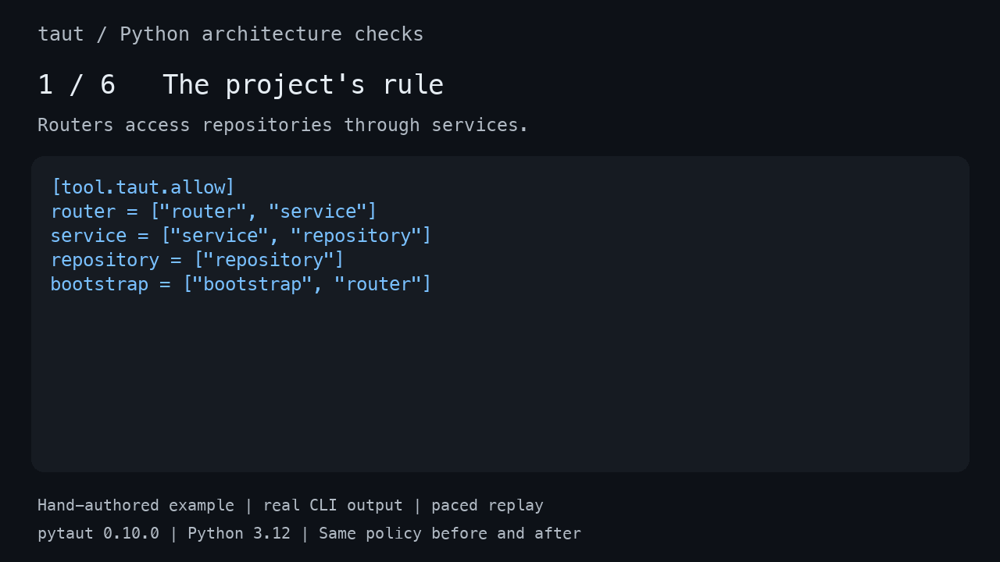

<div align="center">

<h1>taut</h1>

<p><strong>Your AI writes code. Taut checks your architecture.</strong></p>

<p>Check Python code against your project's architecture rules.<br>
Catch violations locally and enforce the same rules in CI.</p>

<p>
  <a href="#try-the-demo"><strong>Try the demo</strong></a> ·
  <a href="docs/getting-started.md#prompt-for-an-ai-coding-agent"><strong>Set up with your agent</strong></a>
</p>

<p>
  <a href="https://pypi.org/project/pytaut/">PyPI</a> ·
  <a href="docs/getting-started.md">Getting started</a> ·
  <a href="docs/reference.md">Rule reference</a>
</p>

</div>

You write “routers must go through services” in your coding rules. The next change
imports a repository directly. The endpoint still works. Your architecture rule doesn't hold.

Taut catches that forbidden import and tells you where it happened. Give the
diagnostics to your coding agent, or fix the code yourself. The same checks apply
to human-written code.



*Hand-authored FastAPI demo. Real CLI output, replayed for readability.
[Reproduce the results](examples/architecture/README.md).*

The fix is one import. The policy stays the same:

```diff
-from app.repository import read_greeting as get_greeting
+from app.service import get_greeting
```

<a id="try-a-real-violation"></a>

## Try the demo

Requires [uv](https://docs.astral.sh/uv/getting-started/installation/) and Python 3.12+.
Run the example with the published release:

```bash
git clone https://github.com/taewoo-dev/taut.git
cd taut
uvx --python 3.12 --from pytaut==0.10.0 taut check examples/architecture/before --no-cache
```

The check catches the forbidden import and exits with code **1**:

```text
app/router.py:3:1: error: [ARCH001] Role router imports app.repository from disallowed role repository.
Check complete: 1 error, 0 warnings
```

Now check the corrected version:

```bash
uvx --python 3.12 --from pytaut==0.10.0 taut check examples/architecture/after --no-cache
```

```text
Check complete: no policy violations within supported scope
```

<details>
<summary>What about Ruff, mypy, and Pyright?</summary>

Both endpoints return the same HTTP response. The demo also passes its specified
Ruff checks, strict mypy, and strict Pyright in both versions. Those checks do not
encode this project's allowed dependency graph.
[Reproduce the comparison and inspect the exact versions](examples/architecture/README.md#verify-the-comparison).

This example was written by hand to demonstrate the rule, not generated in an
AI session. The animation replays verified CLI output; it is not an AI benchmark.

</details>

## What Taut checks

Declare roles using your own paths and define their allowed dependencies. For
example, these are the dependency edges from the demo's
[complete policy](examples/architecture/policy.toml):

```toml
[tool.taut.allow]
router = ["router", "service"]
service = ["service", "repository"]
repository = ["repository"]
bootstrap = ["bootstrap", "router"]
```

The built-in backend pack has 49 rules covering dependency direction and cycles,
responsibility boundaries, transaction ownership, API conventions, and selected
async and external-call patterns. Providers include Python core, FastAPI,
Pydantic, pytest, SQLAlchemy, and Tortoise. Each check has a supported scope;
[read the detection limits](docs/detection-quality.md).

Taut works alongside your formatter, linter, type checker, and tests.

## Use it in your project

**Working with an AI coding agent?** Give it the
[setup prompt](docs/getting-started.md#prompt-for-an-ai-coding-agent)
to walk through configuration and verification. You review the policy decisions.
Installation alone does not attach agent hooks or make the agent run checks.

To start setup yourself:

```bash
uv add --dev pytaut==0.10.0
uv run taut init . --format json
```

The first init produces a proposal; exit **2** is expected while setup questions
remain. It does not write a finished policy. Review the proposed roles and
dependencies, provide the required decisions, and complete setup using the
[step-by-step guide](docs/getting-started.md).

Once configured, run:

```bash
uv run taut config validate .
uv run taut audit .
uv run taut check . --no-cache
```

Use `--format json` for structured diagnostics. Exit **0** means the configured,
supported checks completed without blocking issues; **1** means enforced
violations; **2** means configuration, assurance, or analysis is incomplete.

## Add a CI gate

After setup and the first checks pass, add this step to a job that has installed
the project's locked development dependencies:

```yaml
- name: Check architecture policy
  run: |
    uv run taut config validate .
    uv run taut audit .
    uv run taut check . --no-cache
```

For merge enforcement, make that CI job a required check in your repository's
branch protection or ruleset. The CLI reports failures; your CI and repository
settings determine whether merging is blocked.

## Try it on your code

Try the demo or set up Taut in your project, then
[report where you got stuck](https://github.com/taewoo-dev/taut/issues/new?template=adoption.yml).
Include the Taut version, command, and a small reproducible example where possible.

Did Taut catch a violation before code review? Give it a star to help others find it.

## Documentation

- [Complete configuration and CLI reference](docs/reference.md)
- [Multiple Python projects in one repository](docs/getting-started.md#choose-project-or-workspace-scope)
- [Stable path-based configuration](docs/configuration-conventions.md)
- [Measured detection limits and advisory adoption](docs/detection-quality.md)
- [Migration guide](MIGRATION.md) · [Changelog](CHANGELOG.md)
- [Contributing](CONTRIBUTING.md) · [Security](SECURITY.md) · [MIT license](LICENSE)
